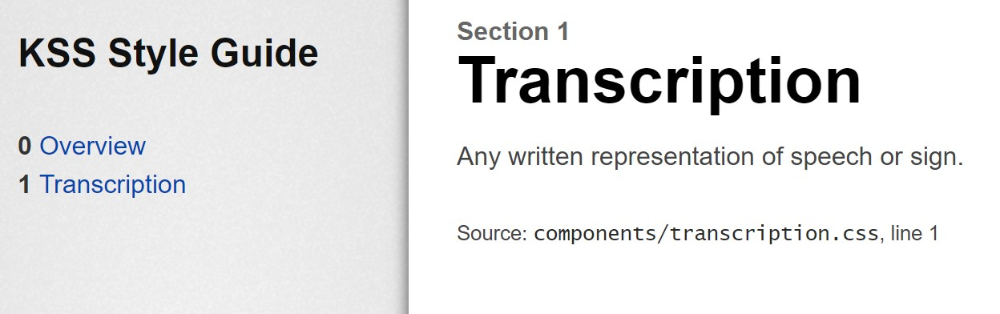
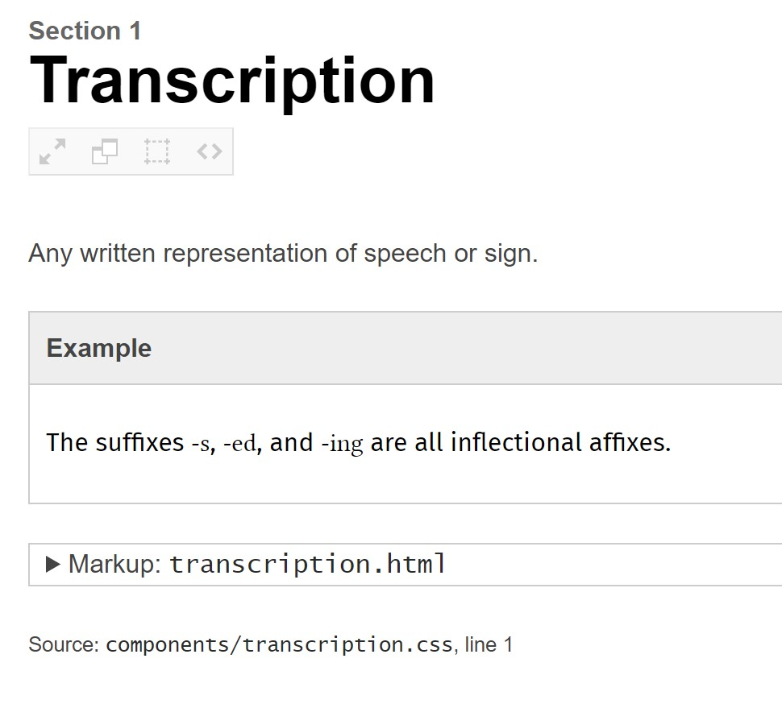
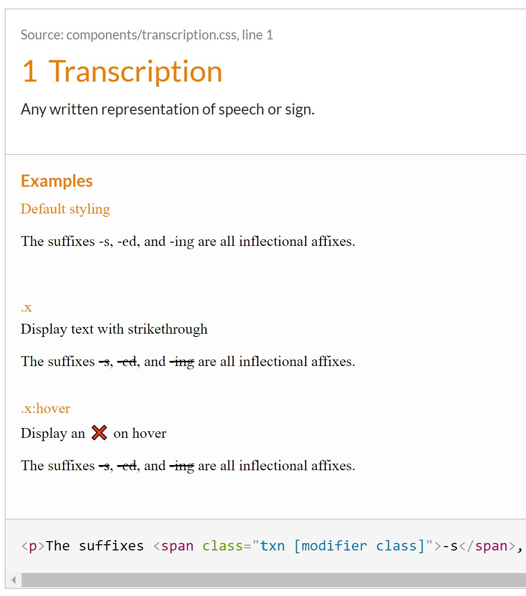
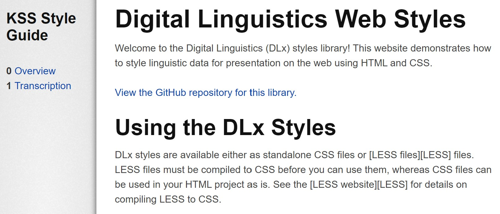
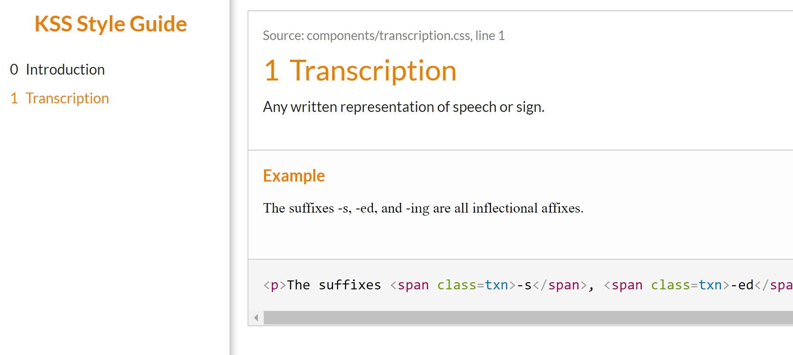

<!-- TOC -->

- [Setup](#setup)
- [Documenting a Component](#documenting-a-component)
- [Variations](#variations)
- [Landing Page](#landing-page)
- [Structuring the Pattern Library](#structuring-the-pattern-library)
- [Themes](#themes)
- [Configuration](#configuration)
- [Build Process](#build-process)

<!-- /TOC -->

This week the [Digital Linguistics project][DLx.io] released [a brand new pattern library][styles] for styling linguistic data on the web. A <dfn>pattern library</dfn> (also called a <dfn>component library</dfn>) is a collection of HTML and CSS snippets for individual pieces or "components" of a website. The components typically include things like buttons, navigation, articles, cards, etc. Pattern libraries are different from <dfn>design systems</dfn>, which are a holistic specification of the design principles and philosophy for an organization. They are also different from <dfn>style guides</dfn>, which specify global rules that are applicable across all areas of design, such as color schemes, typography, spacing, and iconography.

The DLx pattern library is a collection of HTML and CSS snippets for styling _linguistic_ elements on a webpage, such as interlinear glosses, citation forms of words in running prose, phonetic transcriptions, etc.

[Check out the DLx pattern library here!][styles]

**This post walks through the process of building the DLx pattern library and discusses some of the design decisions involved.** I used a format for documenting CSS called <abbr><a href="http://warpspire.com/kss/">KSS</a></abbr> (Knyle Style Sheets), which can be used to automatically generate pattern libraries and style guides like the [DLx pattern library][styles].

## Setup

The DLx pattern library is built using [Node.js][Node] and a library for automatically generating living styleguides from KSS comments called [`kss-node`][kss-node]. The following steps walk through the process of setting up the project.

1. [Install Node.js and its bundled package manager npm][install-Node] first. I recommend installing the most recent LTS (Long Term Support) release.

2. Initialize the project by creating a `package.json` file, which contains configuration for the project, among many other things. (See the [package.json guide][package-json-guide].) You can generate a `package.json` by running `npm init` and answering the prompts that appear.

3. Install `kss-node` with the command `npm i -D kss`. The library is now listed as a development dependency in `package.json`, so that we can use it in scripts in our project:

  ```json
  "devDependencies": {
    "kss": "^3.0.1"
  }
  ```

4. Now let's add a build script that will run the `kss-node` script for our project and generate our pattern library. Add the following to `package.json`:

  ```json
  "scripts": {
    "build": "kss --source components --destination docs"
  }
  ```

  This tells `kss-node` to process all the files in the `/components` directory, look for KSS comments in those files, and generate the living pattern library in the `/docs` directory. (`kss-node` outputs to `/styleguide` by default.) We run the script by entering `npm run build` on the command line.

5. Create the `/components` directory in our project where each of our patterns will live.

6. `kss-node` needs at least one file to process or it will throw an error, so let's add a very simple component for a <dfn>transcription</dfn> (any written representation of speech or signing) in `/components/transcription.css`:

  **`/components/transcription.css`**
  ```css
  /*
  Transcription

  Any written representation of speech or sign.

  Styleguide 1
  */
  .txn,
  .transcription {
    font-family:
      'Linux Libertine',
      'Charis SIL',
      'Gentium Plus',
      'Doulos SIL',
      'Source Serif Pro',
      'Noto Serif',
      'Times New Roman',
      serif;
  }
  ```

  The only thing the `.txn` / `.transcription` class does is set the font to a serif font with good Unicode support, with various fallback fonts. The `.transcription` class will be used in various other types of transcription styles later, such as orthographic, phonemic, and phonetic transcriptions.

  The comment above the `.transcription` class is a KSS comment, consisting of a heading, a description, and the location in the style guide where we want the documentation for the `.transcription` class to be displayed. There has to be at least one KSS comment in the source files, or `kss-node` will throw an error. Complete documentation on how to format KSS comments and the kinds of information they can contain can be found in the [KSS specification][KSS].

  **NOTE:** `kss-node` can process any file format (CSS, LESS, SCSS, etc.), as long as the comments are valid CSS comments. This allows you to use your favorite CSS pre-/post-processor in your project.

7. Now if we run `npm run build` on the command line, `kss-node` will generate our living style guide in the `/docs` folder. Open `/docs/index.html` in a browser to see the generated documentation!

  

  For the moment, the result is pretty lame. The Overview page has nothing on it because we haven't provided a README to `kss-node` yet, and the Transcription link shows the description for the `.transcription` class but no examples because we haven't given it any HTML yet. In the next section we'll add some example markup and populate the library with a few components.

## Documenting a Component

KSS allows you to include the following kinds of information about a component in the KSS comment:

- a **heading** / title (_required_)
- a **description** of what the style does (_optional_)
- [`kss-node` only] **example HTML markup** OR the path to a file containing example HTML markup (_optional_)
- a list of **modifier classes** or **psuedo-classes** and how they modify the style (_optional_)
- the **position in the styleguide** where the component should be displayed

Let's add some example markup to our `.transcription` class. There are two ways to add example markup: 1) inline in the KSS comment, or 2) in a separate HTML or [Handlebars][Handlebars] file. ([Handlebars][Handlebars] is an HTML templating language which allows you to use variables in your HTML.)

Here's what our example markup looks like using each of these methods. I chose to use standalone HTML files for example markup in the DLx pattern library.

**inline markup**
```css
/*
Transcription

Any written representation of speech or sign.

Markup:
<p>The suffixes <span class=txn>‑s</span>, <span class=txn>‑ed</span>, and <span class=txn>‑ing</span> are all inflectional affixes.</p>

Styleguide 1
*/
.txn,
.transcription {
  …
}
```

**external markup file**

`transcription.css`
```css
/*
Transcription

Any written representation of speech or sign.

Markup: transcription.html

Styleguide 1
*/
.txn,
.transcription {
  …
}
```

`transcription.html`
```html
<p>The suffixes <span class=txn>‑s</span>, <span class=txn>‑ed</span>, and <span class=txn>‑ing</span> are all inflectional affixes.</p>
```

Now if we rebuild the project (`npm run build`), the Transcription page shows the example markup, but without the `.transcription` styles applied! This is because KSS _parses_ the comments in the CSS file, but doesn't _copy_ any CSS files into the generated documentation. We have to do that ourselves. We also have to tell `kss-node` to include the stylesheet in the HTML (using a `<link rel=stylesheet>` tag) with the `--css` flag, like so:

```json
"scripts": {
  "build": "kss --source components --css transcription.css"
},
```

To copy the CSS files, I wrote a Node script called `copyFiles.js` in a new `/build` folder which copies `transcription.css` into the `/docs` directory. (Later we'll use this to copy other files into the output directory as well.)

**`build/copyFiles.js`**
```js
import { fileURLToPath } from 'url';
import fs                from 'fs';
import path              from 'path';

const { copyFile } = fs.promises;

// const currentDir    = path.dirname(fileURLToPath(import.meta.url));
const componentsDir = path.join(currentDir, `../components`);
const outDir        = path.join(currentDir, `../docs`);

copyFile(
  path.join(componentsDir, `transcription.css`),
  path.join(outDir, `transcription.css`)
);
```

In `package.json`, we specify that we want this script to run after the KSS style guide is done building (note the addition of `"type": "module"` to allow this file to be run as an ES module):

```json
"type": "module",
"scripts": {
  "build": "kss --source components --destination docs --css ./components/transcription.css",
  "postbuild": "node build/copyFiles.js"
}
```

Now when we build the project, the pattern library applies the `.transcription` class to the example markup. The elements with the `.transcription` class added to them appear in a different font than the surrounding text—the expected behavior. We just documented our first component!



From here the process pretty much repeats itself. For each component, create a stylesheet (`transcription.css`) and accompanying example markup (`transcription.html`), and copy the CSS into the output directory. In the remaining sections we'll cover a number of other improvements, but we now know how to accomplish the core task of creating a pattern library.

## Variations

As mentioned in the [Documenting a Component](#documenting-a-component) section, you can instruct `kss-node` to generate variations on a component by using modifier classes or pseudo-classes in the KSS comment and example markup.

For example, say we wanted to create a crossed-out variation of the `.transcription` class, that renders with a strikethrough. Let's call this modifier class `.x`. We'd also like this class to have a special behavior on hover so that a "not allowed" (🚫) cursor is displayed. Each of these is considered a variation by KSS. We would structure the KSS comment, CSS, and example HTML to show these variations like this:

```css
/*
Transcription

Any written representation of speech or sign.

.x       - Display text with strikethrough
.x:hover - Display an 🚫 on hover

Markup: transcription.html

Styleguide 1
*/
.txn,
.transcription {
  font-family:
    'Linux Libertine',
    'Charis SIL',
    'Gentium Plus',
    'Doulos SIL',
    'Source Serif Pro',
    'Noto Serif',
    'Times New Roman',
    serif;
}

.txn.x,
.transcription.x {
  text-decoration: line-through;
}

.txn.x:hover,
.transcription.x:hover {
  cursor: not-allowed;
}
```

```html
<p>The suffixes <span class="txn {{ modifier_class }}">‑s</span>, <span class="txn {{ modifier_class }}">‑ed</span>, and <span class="txn {{ modifier_class }}">‑ing</span> are all inflectional affixes.</p>
```

This is the result:



## Landing Page

Right now our pattern library displays a desolate, empty landing page. Let's give it a README by adding the `--homepage` flag to our build script and rerunning the build script:

```json
"build": "kss --source components --destination docs --css transcription.css --homepage README.md"
```

Beautiful! Now we have a nice landing page for the project:



## Structuring the Pattern Library

The final part of the KSS comment is for specifying where a component lives in the pattern library. The following are examples of ways you can adjust the placement of a component:

```
Styleguide 2.1.3.
Styleguide Forms.Checkboxes
Styleguide Forms - Special Checkboxes
No styleguide reference. // Necessary to exclude KSS comments from the documentation.
```

If you use words / phrases rather than numbers to structure your documentation, KSS orders components alphabetically by default. You can include a `weight` property within the KSS comment to set the order of each component, like so (lower numbers follow higher numbers):

```
// Sass mixins
//
// Style guide: sass.mixins

// Sass colors
//
// Style guide: sass.colors

// Sass variables
//
// Weight: -10
//
// Style guide: sass.variables

// Sass
//
// Weight: -1
//
// Style guide: sass

// Components
//
// Style guide: components
```

The above KSS comments produce the following hierarchy:

```
1: Sass
  1.1: Sass variables
  1.2: Sass colors
  1.3: Sass mixins
2: Components
```

Note that you can use KSS comments without any accompanying CSS. This allows you to create arbitrary styleguide sections as needed, or document a component separately from the actual code. If you wanted to, you could create an entire KSS pattern library using a CSS file filled with nothing but comments!

## Themes

You can change the theme of the generated documentation by using a custom "builder". This is as easy as installing the theme you wish to use and passing it to `kss-node` with the `--builder` flag. I like the [michelangelo][michelangelo] theme:

```cmd
npm i -D michelangelo
```

```json
"build": "kss --source components --destination docs --css transcription.css --homepage README.md --builder node_modules/michelangelo/kss_styleguide/custom-template/"
```

Now we're looking stylish!



## Configuration

Our build script is getting a little unwieldy, so let's move it to a configuration file instead.

First, create a `kss.config.json` file in the project root:

```json
{
  "builder":     "./node_modules/michelangelo/kss_styleguide/custom-template/",
  "css":         "./transcription.css",
  "destination": "docs/",
  "homepage":    "./README.md",
  "source":      "./components",
  "title":       "DLx Pattern Library"
}
```

There are several things to notice about the config file:

* The `"title"` property customizes the name of the generated site. Here I changed it to ✨ "DLx Pattern Library" ✨.
* The `"source"` field can be an array, so you can process multiple source directories at once.
* The `"css"` property is also an array, allowing you to add multiple `<link rel=stylesheet>` elements to the page header.
* You can also include a `"js"` property to add `<script src={filename}>` elements to the generated documentation as well. This is useful if any of your components require JavaScript. (Remember that you still have to manually copy the JavaScript files into the output directory like you did for the CSS.)

Next, update the build script in `package.json` to point to the new config file, then rebuild the project.

```json
"build": "kss --config kss.config.json"
```

## Build Process

Finally, we can improve our build process in a couple ways:

First, `kss-node` does not clean the output directory when it builds the documentation, which results in a slow accumulation of extraneous files over time. To address this, I added a prebuild script which empties the `/docs` directory before building:

```json
"scripts": {
  "prebuild":  "node build/emptyDocs.js",
  "build":     "kss --config kss.config.json",
  "postbuild": "node build/copyFiles.js"
},
```

I used the `fs-extra` library for this task (`npm i -D fs-extra`):

```js
import { emptyDir }      from 'fs-extra';
import { fileURLToPath } from 'url';
import path              from 'path';

// const currentDir = path.dirname(fileURLToPath(import.meta.url));
const outDir     = path.join(currentDir, `../docs`);

emptyDir(outDir);
```

Secondly, if your project has many components, it will become tedious to add every CSS file to the KSS config file _and_ copy each one into the output directory. Instead, I chose to bundle all of the CSS files into a single file using [LESS][LESS] imports, and copy that single CSS file into the output directory. (Remember that `kss-node` can process any type of file, as long as it contains valid CSS comments.)

I started by changing the extension of all my CSS files from `.css` to `.less` (remember that LESS is a superset of CSS, so CSS is valid LESS). Then in the `/components` directory, I created a `patterns.less` file, and imported each of the individual components into it as follows:

```less
@import interlinear.less
@import transcription.less
@import translation.less
…
```

Then I added a compile step to the prebuild script:

```json
"scripts": {
  "prebuild":  "node build/emptyDocs.js & less components/patterns.less docs/patterns.css",
  "build":     "kss --config kss.config.json",
  "postbuild": "node build/copyFiles.js"
},
```

I also added the `patterns.css` file to the `kss-node` config:

```json
"css": "./patterns.css",
```

[Check out the finished DLx pattern library for yourself!][styles]

## Additional Resources

* [Digital Linguistics on GitHub][org]
* [the Digital Linguistics website][DLx.io]
* [the DLx pattern library][styles]
* [KSS specification][KSS]
* [`kss-node` documentation][kss-node]
* [`kss-node`–specific guidelines for KSS comments][kss-node-docs]

<!-- Links -->
[DLx.io]:             https://digitallinguistics.io
[Handlebars]:         https://handlebarsjs.com/
[install-Node]:       https://nodejs.org/en/download/
[KSS]:                http://warpspire.com/kss/
[kss-node]:           https://github.com/kss-node/kss-node
[kss-node-docs]:      https://github.com/kss-node/kss/blob/spec/SPEC.md
[LESS]:               http://lesscss.org/
[package-json-guide]: https://nodejs.dev/learn/the-package-json-guide
[Node]:               https://nodejs.org/
[org]:                https://github.com/digitallinguistics/
[styles]:             https://styles.digitallinguistics.io/
